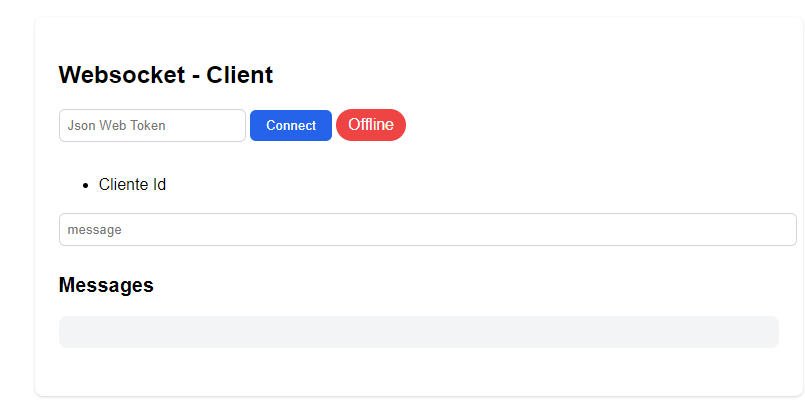
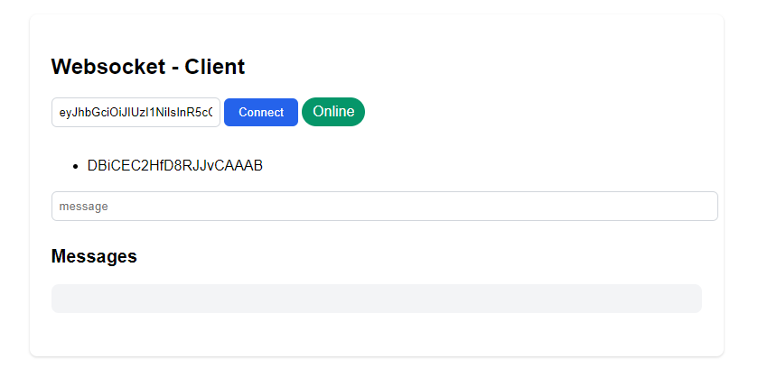

# Websocket Client (ws-client)

This is a simple WebSocket client that allows you to connect to a WebSocket server using a JWT token for authentication. The client displays the connection status and allows sending and receiving messages.

## Features

- Connection to a WebSocket server.
- Authentication using a JWT token.
- Display of connected clients.
- Sending and receiving messages.

## Technologies Used

- **TypeScript**: For developing the client.
- **Socket.IO**: For real-time communication.
- **Vite**: For building and developing the project.

## Installation

1. Clone the repository:

   ```bash
   git clone <REPOSITORY_URL>
   cd ws-client
   ```

2. Install the dependencies:

   ```bash
   npm install
   ```

## Usage

1. Make sure your WebSocket server is running.
2. Start the client:

   ```bash
   npm run dev
   ```

3. Open your browser and go to `http://localhost:3000` to access the client.
4. Enter your JWT token in the corresponding field and click "Connect" to establish the connection.
5. Send messages using the message input field.

## Project Structure

- `src/`
  - `socket-client.ts`: Connection logic and WebSocket event handling.
  - `style.css`: Styles for the user interface.
  - `main.ts`: Entry point of the application.

- `package.json`: Project configuration and dependencies.

## Screenshot

Below is how the project visually looks:




## Contributions

Contributions are welcome. If you would like to contribute, please open an issue or send a pull request.

## License

This project is under the MIT License. See the LICENSE file for more details.